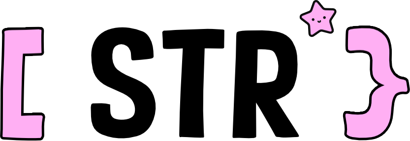

<p align="center">
  
</p>

<h1 align="center">str</h1>

<p align="center">
  <strong>Unicode-aware string utilities for Gleam</strong>
</p>

<p align="center">
  <a href="https://hex.pm/packages/str"></a>
  <a href="https://hexdocs.pm/str/"></a>
  <a href="https://opensource.org/licenses/MIT"></a>
</p>

> **Production-ready** Gleam library providing Unicode-aware string operations with a focus on grapheme-cluster correctness, pragmatic ASCII transliteration, and URL-friendly slug generation.

---

## ✨ Features

| Category | Highlights |
|----------|------------|
| 🎯 **Grapheme-Aware** | All operations correctly handle Unicode grapheme clusters (emoji, ZWJ sequences, combining marks) |
| 🔤 **Case Conversions** | `snake_case`, `camelCase`, `kebab-case`, `PascalCase`, `Title Case`, `capitalize` |
| 🔗 **Slug Generation** | Configurable `slugify` with token limits, custom separators, and Unicode preservation |
| 🔍 **Search & Replace** | `index_of`, `last_index_of`, `replace_first`, `replace_last`, `contains_any/all` |
| ✅ **Validation** | `is_uppercase`, `is_lowercase`, `is_title_case`, `is_ascii`, `is_hex`, `is_numeric`, `is_alpha` |
| 🛡️ **Escaping** | `escape_html`, `unescape_html`, `escape_regex` |
| 📏 **Similarity** | Levenshtein `distance`, percentage `similarity`, `hamming_distance` |
| 🧩 **Splitting** | `splitn`, `partition`, `rpartition`, `chunk`, `lines`, `words` |
| 📐 **Padding** | `pad_left`, `pad_right`, `center`, `fill` |
| 🚀 **Zero Dependencies** | Pure Gleam implementation with no OTP requirement |

---

## 📦 Installation

```sh
gleam add str
```

---

## 🚀 Quick Start

```gleam
import str/core
import str/extra

pub fn main() {
  // 🎯 Grapheme-safe truncation preserves emoji
  let text = "Hello 👩‍👩‍👧‍👦 World"
  core.truncate(text, 10, "...")
  // → "Hello 👩‍👩‍👧‍👦..."

  // 🔗 ASCII transliteration and slugification
  extra.slugify("Crème Brûlée — Recipe 2025!")
  // → "creme-brulee-recipe-2025"

  // 🔤 Case conversions
  extra.to_camel_case("hello world")   // → "helloWorld"
  extra.to_snake_case("Hello World")   // → "hello_world"
  core.capitalize("hELLO wORLD")       // → "Hello world"

  // 🔍 Grapheme-aware search
  core.index_of("👨‍👩‍👧‍👦 family test", "family")
  // → Ok(2) - counts grapheme clusters, not bytes!

  // 📏 String similarity
  core.similarity("hello", "hallo")
  // → 0.8 (80% similar)
  
  // 🛡️ HTML escaping
  core.escape_html("<script>alert('xss')</script>")
  // → "&lt;script&gt;alert(&#39;xss&#39;)&lt;/script&gt;"
}
```

---

## 📚 API Reference

### 🔤 Case & Capitalization

| Function | Example | Result |
|----------|---------|--------|
| `capitalize(text)` | `"hELLO wORLD"` | `"Hello world"` |
| `swapcase(text)` | `"Hello World"` | `"hELLO wORLD"` |
| `is_uppercase(text)` | `"HELLO123"` | `True` |
| `is_lowercase(text)` | `"hello_world"` | `True` |
| `is_title_case(text)` | `"Hello World"` | `True` |

### ✂️ Grapheme Extraction

| Function | Example | Result |
|----------|---------|--------|
| `take(text, n)` | `take("👨‍👩‍👧‍👦abc", 2)` | `"👨‍👩‍👧‍👦a"` |
| `drop(text, n)` | `drop("hello", 2)` | `"llo"` |
| `take_right(text, n)` | `take_right("hello", 3)` | `"llo"` |
| `drop_right(text, n)` | `drop_right("hello", 2)` | `"hel"` |
| `at(text, index)` | `at("hello", 1)` | `Ok("e")` |
| `chunk(text, size)` | `chunk("abcdef", 2)` | `["ab", "cd", "ef"]` |

### 🔍 Search & Replace

| Function | Example | Result |
|----------|---------|--------|
| `index_of(text, needle)` | `"hello world", "world"` | `Ok(6)` |
| `last_index_of(text, needle)` | `"hello hello", "hello"` | `Ok(6)` |
| `contains_any(text, needles)` | `"hello", ["x", "e", "z"]` | `True` |
| `contains_all(text, needles)` | `"hello", ["h", "e"]` | `True` |
| `replace_first(text, old, new)` | `"aaa", "a", "b"` | `"baa"` |
| `replace_last(text, old, new)` | `"aaa", "a", "b"` | `"aab"` |

### ⚠️ Experimental: Search Strategies

**Algorithms:**
- **KMP**: optimized for long/repetitive patterns
- **Sliding**: fast for short patterns, zero allocations

**APIs:**

| Function | Description |
|----------|-------------|
| `index_of_auto(text, pattern)` | Auto-select algorithm (heuristic) |
| `index_of_strategy(text, pattern, Kmp\|Sliding)` | Explicit algorithm choice |
| `count_auto(text, pattern, overlapping)` | Auto-select for counting |
| `count_strategy(text, pattern, overlapping, Kmp\|Sliding)` | Explicit count algorithm |

**Examples:**

```gleam
// Force KMP explicitly
core.index_of_strategy("long text...", "pattern", core.Kmp)

// Let heuristic decide (experimental)
core.index_of_auto("some text", "pat")
```

> **Note:** `_auto` variants use heuristics and may not always choose optimally. For performance-critical code, use `_strategy` variants. Configure thresholds in `src/str/config.gleam`.

### 🧩 Splitting & Partitioning

| Function | Example | Result |
|----------|---------|--------|
| `partition(text, sep)` | `"a-b-c", "-"` | `#("a", "-", "b-c")` |
| `rpartition(text, sep)` | `"a-b-c", "-"` | `#("a-b", "-", "c")` |
| `splitn(text, sep, n)` | `"a-b-c-d", "-", 2` | `["a", "b-c-d"]` |
| `words(text)` | `"hello  world"` | `["hello", "world"]` |
| `lines(text)` | `"a\nb\nc"` | `["a", "b", "c"]` |

### 📐 Padding & Filling

| Function | Example | Result |
|----------|---------|--------|
| `pad_left(text, width, pad)` | `"42", 5, "0"` | `"00042"` |
| `pad_right(text, width, pad)` | `"hi", 5, "*"` | `"hi***"` |
| `center(text, width, pad)` | `"hi", 6, "-"` | `"--hi--"` |
| `fill(text, width, pad, pos)` | `"x", 5, "-", "both"` | `"--x--"` |

### ✅ Validation

| Function | Description |
|----------|-------------|
| `is_numeric(text)` | Digits only (0-9) |
| `is_alpha(text)` | Letters only (a-z, A-Z) |
| `is_alphanumeric(text)` | Letters and digits |
| `is_ascii(text)` | ASCII only (0x00-0x7F) |
| `is_printable(text)` | Printable ASCII (0x20-0x7E) |
| `is_hex(text)` | Hexadecimal (0-9, a-f, A-F) |
| `is_blank(text)` | Whitespace only |
| `is_title_case(text)` | Title Case format |

### 🔗 Prefix & Suffix

| Function | Example | Result |
|----------|---------|--------|
| `remove_prefix(text, prefix)` | `"hello world", "hello "` | `"world"` |
| `remove_suffix(text, suffix)` | `"file.txt", ".txt"` | `"file"` |
| `ensure_prefix(text, prefix)` | `"world", "hello "` | `"hello world"` |
| `ensure_suffix(text, suffix)` | `"file", ".txt"` | `"file.txt"` |
| `starts_with_any(text, list)` | `"hello", ["hi", "he"]` | `True` |
| `ends_with_any(text, list)` | `"file.txt", [".txt", ".md"]` | `True` |
| `common_prefix(strings)` | `["abc", "abd"]` | `"ab"` |
| `common_suffix(strings)` | `["abc", "xbc"]` | `"bc"` |

### 🛡️ Escaping

| Function | Example | Result |
|----------|---------|--------|
| `escape_html(text)` | `"<div>"` | `"&lt;div&gt;"` |
| `unescape_html(text)` | `"&lt;div&gt;"` | `"<div>"` |
| `escape_regex(text)` | `"a.b*c"` | `"a\\.b\\*c"` |

### 📏 Similarity & Distance

| Function | Example | Result |
|----------|---------|--------|
| `distance(a, b)` | `"kitten", "sitting"` | `3` |
| `similarity(a, b)` | `"hello", "hallo"` | `0.8` |
| `hamming_distance(a, b)` | `"karolin", "kathrin"` | `Ok(3)` |

### 📝 Text Manipulation

| Function | Description |
|----------|-------------|
| `truncate(text, len, suffix)` | Truncate with emoji preservation |
| `ellipsis(text, len)` | Truncate with … |
| `reverse(text)` | Grapheme-aware reversal |
| `reverse_words(text)` | Reverse word order |
| `initials(text)` | Extract initials (`"John Doe"` → `"JD"`) |
| `normalize_whitespace(text)` | Collapse whitespace |
| `strip(text, chars)` | Remove chars from ends |
| `squeeze(text, char)` | Collapse consecutive chars |
| `chomp(text)` | Remove trailing newline |

### 📄 Line Operations

| Function | Description |
|----------|-------------|
| `lines(text)` | Split into lines |
| `dedent(text)` | Remove common indentation |
| `indent(text, spaces)` | Add indentation |
| `wrap_at(text, width)` | Word wrap |

---

## 🔤 Extra Module (str/extra)

### Case Conversions

```gleam
import str/extra

extra.to_snake_case("Hello World")    // → "hello_world"
extra.to_camel_case("hello world")    // → "helloWorld"
extra.to_pascal_case("hello world")   // → "HelloWorld"
extra.to_kebab_case("Hello World")    // → "hello-world"
extra.to_title_case("hello world")    // → "Hello World"
```

### ASCII Folding (Deburr)

```gleam
extra.ascii_fold("Crème Brûlée")  // → "Creme Brulee"
extra.ascii_fold("straße")        // → "strasse"
extra.ascii_fold("æon")           // → "aeon"
```

### Slug Generation

```gleam
extra.slugify("Hello, World!")                    // → "hello-world"
extra.slugify_opts("one two three", 2, "-", False) // → "one-two"
extra.slugify_opts("Hello World", 0, "_", False)   // → "hello_world"
```

---

## 🏗️ Module Guide

### Which module should I use?

| Module | When to use | Import |
|--------|-------------|--------|
| **`str`** | Most common operations | `import str` |
| **`str/core`** | Full grapheme-aware API, advanced features | `import str/core` |
| **`str/extra`** | ASCII folding, slugs, case conversions | `import str/extra` |
| **`str/tokenize`** | Reference implementation (pedagogic only) | `import str/tokenize` |

**Quick start:** Use `import str` for everyday needs. The main `str` module re-exports commonly used functions from `core` and `extra`.

**Advanced users:** Import `str/core` and `str/extra` directly when you need the complete API or want explicit control.

### Module structure

```
str/
├── str.gleam       # Main module (re-exports common functions)
├── core.gleam      # Grapheme-aware utilities
├── extra.gleam     # ASCII folding, slugs, case conversions
├── tokenize.gleam  # Pure-Gleam tokenizer (reference)
└── internal_*      # Character tables (not public API)
```

---

## 📖 Documentation

| Document | Description |
|----------|-------------|
| [Core API](docs/str_core.md) | Grapheme-aware string operations |
| [Extra API](docs/str_extra.md) | ASCII folding and slug generation |
| [Tokenizer](docs/str_tokenize.md) | Pure-Gleam tokenizer reference |
| [Examples](EXAMPLES.md) | Integration examples and OTP patterns |
| [Character Tables](docs/character_tables.json) | Machine-readable transliteration data |

---

## ⚡ Optional OTP Integration

The library core is OTP-free by design. For production Unicode normalization (NFC/NFD):

```gleam
// In your application code:
pub fn otp_nfd(s: String) -> String {
  // Call Erlang's :unicode module
  s
}

// Use with str:
extra.ascii_fold_with_normalizer("Crème", otp_nfd)
extra.slugify_with_normalizer("Café", otp_nfd)
```

---

## 🧪 Development

```sh
# Run the test suite
gleam test

# Regenerate character tables documentation
python3 scripts/generate_character_tables.py
```

---

## 📊 Test Coverage

- **tests** covering all public functions
- Unicode edge cases (emoji, ZWJ, combining marks)
- Grapheme cluster boundary handling
- Cross-module integration tests

---

## 🤝 Contributing

Contributions welcome! Areas for improvement:

- Expanding character transliteration tables
- Additional test cases for edge cases
- Documentation improvements
- Performance optimizations

```sh
gleam test  # Ensure tests pass before submitting PRs
```

---

## 📄 License

MIT License — see [LICENSE](LICENSE) for details.

---

## 🔗 Links

- [Gleam Language](https://gleam.run/)
- [Unicode Grapheme Clusters (UAX #29)](https://unicode.org/reports/tr29/)
- [Hex Package](https://hex.pm/packages/str)
- [Hex Documentation](https://hexdocs.pm/str/)

---

<div align="center">

**Made with 💜 for the Gleam community**

</div>
